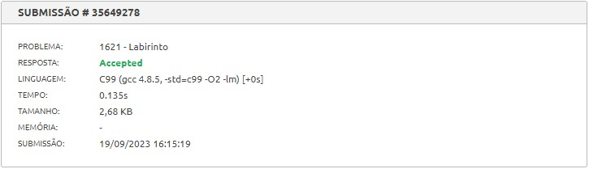
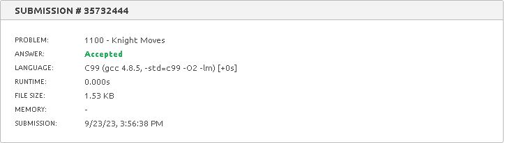
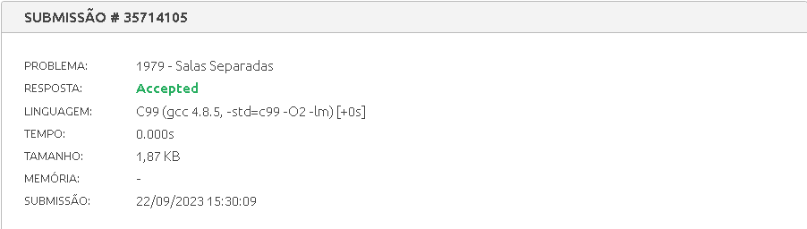
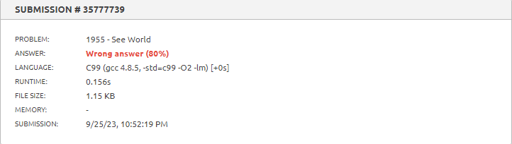

# Exercícios Juiz Online

Tema:
 - Grafos1 

## Alunos
| Matrícula  | Aluno                   |
| ---------- | ----------------------- |
| 18/0102761 | Jefferson França Santos |
| 20/0049879 |  Yago Milagres Passos   |

## Sobre 
Exercícios do Beecrowd com nível 5 ou mais.
  
Exercícios escolhidos:

- [Labirinto - 1621](https://www.beecrowd.com.br/repository/UOJ_1621.html)
- [See World - 1955](https://www.beecrowd.com.br/judge/en/problems/view/1955)
- [Knight Moves - 1100](https://www.beecrowd.com.br/judge/en/problems/view/1100)
- [Salas Separadas - 1979](https://www.beecrowd.com.br/repository/UOJ_1979.html)

## Screenshots

## Link da apresentação
O arquivo do vídeo está presente [aqui](./videoApresentacao_Grafos1.mp4).

Ou pode acessá-lo pelo link:

https://www.youtube.com/watch?v=xq7s_652XGw

## Instalação 
**Linguagem**: C 
[Tutorial de instalação](https://learn.microsoft.com/pt-br/cpp/build/vscpp-step-0-installation?view=msvc-170)

## Uso 
Para testar os códigos, você pode copiá-los e os inserir em seus respectivos links do [beecrowd](https://www.beecrowd.com.br/judge/en/login), disponíveis nas pastas de cada problema.

